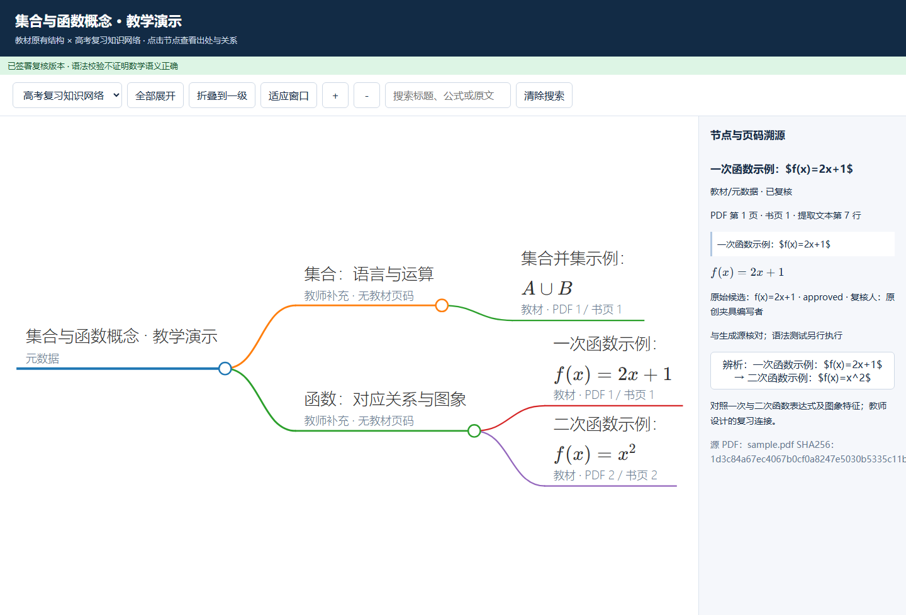

# 高中数学教材双模式思维导图 · high-school-math-textbook-mindmap



把高中数学教材 PDF 变成**可溯源、可人工复核**的思维导图：一份忠于教材目录的「教材模式」，一份按高考复习组织的「复习模式」，最后导出一个**完全离线、双击即开**的单文件 HTML（内嵌 Markmap、D3、KaTeX 及全部字体）。

面向人教A版高中数学教师的备课与复习场景，可作为 Codex / Claude 等智能体的 Skill 使用，也可以直接用命令行运行。

> English: A runnable agent skill that turns a high-school math textbook PDF into a traceable, teacher-reviewed dual-mode mind map (strict textbook structure + exam-review network) and exports a fully offline single-file HTML with Markmap, KaTeX and embedded fonts.

## ✨ 特点

- **双模式导图**：教材模式保留原文标题、顺序与页码；复习模式允许教师补充分组、先修与易混辨析，并标注来源。
- **每个节点可溯源**：点击节点即可看到 PDF 页、印刷页码、提取行和原文。
- **公式人工把关**：公式候选需手工转录 LaTeX 并签署，KaTeX 语法检查保证可渲染。
- **发布门禁**：未复核的页、节点、公式会以草稿标记显示，`--release` 会拒绝未审核数据。
- **完全离线**：单个 HTML 不依赖网络和同目录文件，设置 `connect-src 'none'`，适合教室电脑。
- **交互完善**：折叠/展开、滚轮缩放、拖拽、全部展开、适应窗口、搜索（右侧列出结果）、跨章关系列表。

## 🚀 快速体验

下载仓库后直接用 Edge / Chrome 打开 `examples/sample.offline.html`。

> 样例是原创的两页简化材料，用于验证软件，**不是**人教A版教材原文。

## 📦 作为 Skill 安装

将整个 `high-school-math-textbook-mindmap` 文件夹复制到智能体的 skills 目录，例如 Codex：

```powershell
git clone https://github.com/ywangshanxuxu/-high-school-math-textbook-mindmap.git high-school-math-textbook-mindmap
Copy-Item -Recurse high-school-math-textbook-mindmap "$env:USERPROFILE\.codex\skills\"
```

重启后用 `$high-school-math-textbook-mindmap` 调用，或让智能体先读取 `SKILL.md`。已有同名目录请先备份。

## 🛠️ 命令行用法

环境：Python 3.10+、Node 18+。前端依赖已随包提供，无需 `npm install`。

```powershell
python -m venv .venv
$py = '.\.venv\Scripts\python.exe'
& $py -m pip install -r requirements.txt

# 1. 提取草稿（先改 examples/config.json 里的书名、版次、出版社和页码偏移）
& $py scripts/mindmap.py extract 'D:\教材\数学选章.pdf' --config examples/config.json --out work/book.draft.json
# 2. 校验
& $py scripts/mindmap.py validate work/book.draft.json --pdf 'D:\教材\数学选章.pdf'
# 3. 生成草稿 HTML
& $py scripts/mindmap.py build work/book.draft.json --out work/book.draft.html
```

按 `references/review.md` 逐条核对并签署后，正式发布：

```powershell
& $py scripts/mindmap.py validate work/book.reviewed.json --release --pdf 'D:\教材\数学选章.pdf' > work/validation.json
if ($LASTEXITCODE -ne 0) { throw '校验未通过，保留草稿' }
& $py scripts/mindmap.py build work/book.reviewed.json --release --out work/book.offline.html
```

Node 不在 PATH 时追加 `--node 'C:\完整路径\node.exe'`。macOS / Linux 把 `.\.venv\Scripts\python.exe` 换成 `.venv/bin/python` 即可。

## 🔄 工作流程

```
文本层 PDF → 启发式提取草稿 → 人工复核结构与公式 → KaTeX 语法检查 → 离线导出
```

## 📁 目录结构

| 路径 | 说明 |
| --- | --- |
| `SKILL.md` | Skill 入口与工作流程 |
| `scripts/mindmap.py` | 提取 / 校验 / 构建命令行 |
| `scripts/check_math.cjs` | KaTeX 公式语法检查 |
| `scripts/vendor.py` | 联网更新前端依赖（日常无需运行） |
| `references/` | 数据模型、复核规范、JSON Schema |
| `assets/` | HTML 模板与离线依赖（D3、Markmap、KaTeX） |
| `examples/` | 原创样例 PDF、草稿/复核 JSON、离线 HTML、调用提示 |
| `tests/` | 单元测试、浏览器测试与测试报告 |

## 🧪 测试

```powershell
& $py scripts/make_sample.py
& $py -m unittest discover -s tests -v
node tests/browser.cjs examples/sample.offline.html   # 需 playwright + Chromium
```

覆盖提取、页码/指纹、待复核门禁、损坏来源、树循环与顺序、坏公式、恶意标签转义和字体嵌入。

## ⚠️ 边界

- 只处理带文本层的 PDF，**不做 OCR**，不识别图形；扫描件需先由外部 OCR 转录。
- 公式漏检、标题分级、阅读顺序和数学语义都需要人工审核；门禁只检查审核声明，无法证明声明真实。
- 大教材建议按章节拆分后处理，以免 HTML 过大。
- 未使用或验证真实人教A版 PDF。

## 📄 许可证

项目代码采用 [MIT](LICENSE)。第三方库（D3、Markmap、KaTeX）许可证保留在 `assets/vendor/`。

参考：[Markmap API](https://markmap.js.org/api/classes/markmap-view.Markmap.html) · [KaTeX 选项](https://katex.org/docs/options.html) · [pypdf 提取限制](https://pypdf.readthedocs.io/en/stable/user/extract-text.html)
